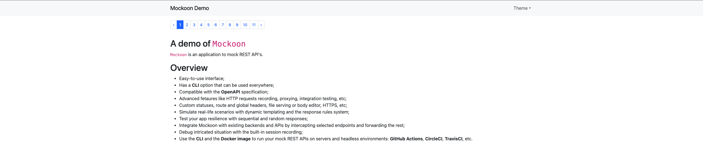

# Mockoon demo

This repository contains the code for the Mockoon demo presentation.

# How to run

## Mockoon UI version

If you want to use the UI version, you need to do this steps first.

- Install Mockoon
- Open Mockoon
- Click __Open environment__
- Select `file-test.json` in the `mockoon` folder
- Click in __Start server__ green icon
- Click __Open environment__
- Select `todo-app.json` in the `mockoon` folder
- Click in __Start server__ green icon

After this, open a new terminal and run 

```shell
   $ npm i
   $ npm run dev
```

## Mockoon CLI version

If you want to use the CLI version, you don't need to install Mockoon.

Open a new terminal and install the dependencies:

```shell
   $ npm i
```

Then start the mock server from the CLI, using:

```shell
   $ npm run mock
```

Open a new terminal and run:

```shell
   $ npm run dev
```

Open the page in http://localhost:5173/, and you should see a page like the one in the image below.


